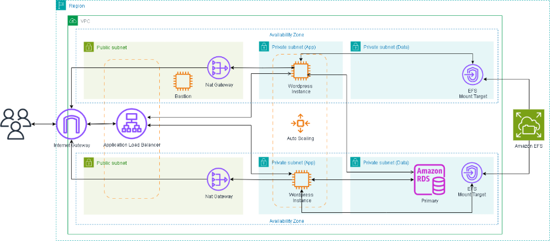
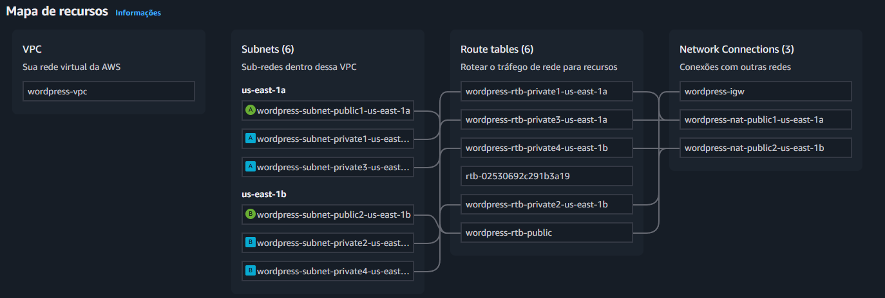
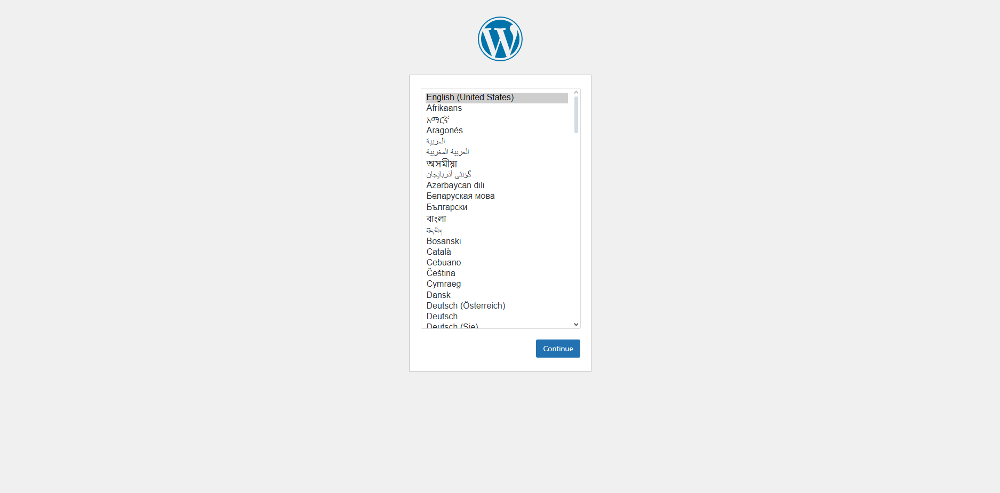
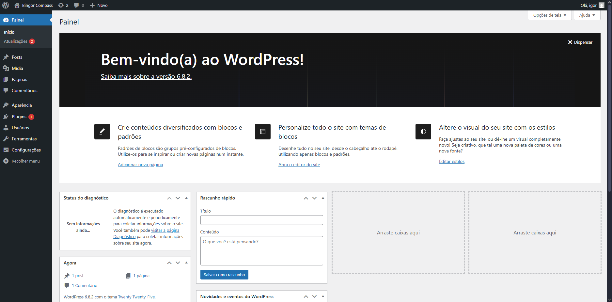
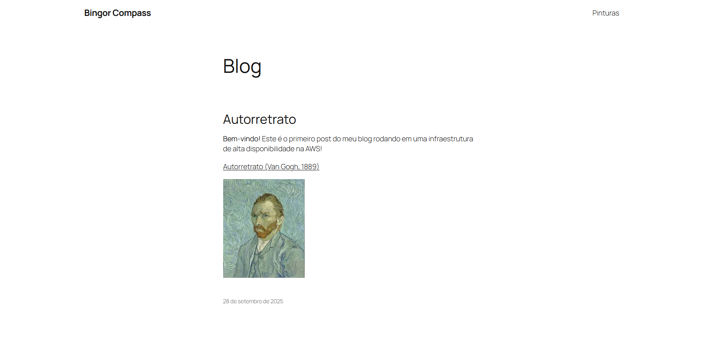

# Infraestrutura de Alta Disponibilidade para WordPress na AWS

## Sobre o Projeto

Este projeto documenta o passo a passo para criar uma infraestrutura escalável e de alta disponibilidade para hospedar um site WordPress na AWS. A arquitetura utiliza um Application Load Balancer para distribuir o tráfego entre instâncias EC2, que são gerenciadas por um Auto Scaling Group. Para garantir a persistência e o compartilhamento de dados entre as instâncias, o Amazon EFS é usado para os arquivos do WordPress e o Amazon RDS (MySQL) para o banco de dados.

### Indice

- [Requisitos](#1-pré-requisitos)
- [Diagrama](#2-diagrama)
- [Configuração do Ambiente](#3-criação-da-vpc)
- [Grupos de segurança](#4-criação-dos-grupos-de-segurança-security-groups)
- [Amazon Relational Database Service (RDS)](#5-amazon-relational-database-service-rds)
- [Amazon Elastic File System (EFS)](#6-amazon-elastic-file-system-efs)
- [Application Load Balancer (ALB)](#7-application-load-balancer-alb)
    - [Criar Grupo de destino](#1-criar-grupo-de-destino-target-group)
    - [Criar do Auto Scaling Group](#2-criar-load-balancer)
- [Auto Scaling Group](#8-auto-scaling-group-asg)
    - [Launch template](#1-launch-template)
    - [Application Load Balancer (ALB)](#2-criar-do-auto-scaling-group)
- [Verificação](#9-verificação)
- [Conclusão](#10-conclusão)


## 1. Pré-requisitos

- Conta na AWS.
- Conhecimento básico dos serviços AWS: VPC, EC2, RDS, EFS, ALB, Auto Scaling.

## 2. Diagrama

Diagrama da Infraestrutura na AWS:



## 3. Criação da VPC
 
1.  No console da AWS, acesse o serviço **VPC**.

2.  Clique em **"Criar VPC"** e selecione a opção **"VPC e mais"**.

3.  Selecione a **Geração automática da etiqueta de nome** e atribua um nome a sua VPC.

4.  Configure os seguintes parâmetros:
    - **Bloco de CIDR IPv4**: `10.0.0.0/16`
    - **Número de zonas de disponibilidade (AZs)**: `2`
    - **Número de sub-redes públicas**: `2`
    - **Número de sub-redes privadas**: `4` 
    - **Gateways NAT**: `1 por AZ`

5.  Clique em **"Criar VPC"**. O console provisionará automaticamente a VPC, sub-redes, tabelas de rotas e o Internet Gateway.




## 4. Criação dos Grupos de Segurança (Security Groups)

1. No console da VPC, acesse **Segurança > Grupos de segurança** e clique em **"Criar grupo de segurança"**.

2. Crie os quatro grupos listados abaixo, um de cada vez. Por enquanto, adicione apenas o **Nome** e a **Descrição**, garantindo que a VPC correta está selecionada.

    -   **1. SG para o EFS**
        -   **Nome**: `efs-sg`
        -   **Descrição**: `Permite acesso NFS a partir das instâncias EC2.`

    -   **2. SG para o RDS**
        -   **Nome**: `rds-sg`
        -   **Descrição**: `Permite acesso MySQL a partir das instâncias EC2.`

    -   **3. SG para as Instâncias EC2**
        -   **Nome**: `ec2-sg`
        -   **Descrição**: `Permite tráfego do ALB e acesso SSH.`

    -   **4. SG para o Application Load Balancer**
        -   **Nome**: `alb-sg`
        -   **Descrição**: `Permite tráfego público HTTP.`

3. Após criar os quatro grupos, edite as **Regras de Entrada (Inbound Rules)** de cada um da seguinte forma:

    -   **Para o `alb-sg`:**
        -   **Tipo**: `HTTP`
        -   **Intervalo de portas**: `80`
        -   **Origem**: `Qualquer lugar-IPv4` (`0.0.0.0/0`)

    -   **Para o `ec2-sg`:**
        -   **Regra 1**:
            -   **Tipo**: `HTTP`
            -   **Intervalo de portas**: `80`
            -   **Origem**: Selecione o Security Group `alb-sg`.
        -   **Regra 2**:
            -   **Tipo**: `SSH`
            -   **Intervalo de portas**: `22`
            -   **Origem**: `Meu IP`.

    -   **Para o `rds-sg`:**
        -   **Tipo**: `MYSQL/Aurora`
        -   **Intervalo de portas**: `3306`
        -   **Origem**: Selecione o Security Group `ec2-sg`.

    -   **Para o `efs-sg`:**
        -   **Tipo**: `NFS`
        -   **Intervalo de portas**: `2049`
        -   **Origem**: Selecione o Security Group `ec2-sg`.

## 5. Amazon Relational Database Service (RDS)

Criação do banco de dados:

1.  Acesse o serviço **RDS** e clique em **"Criar banco de dados"**

2.  Selecione **"Criação padrão"** e o mecanismo **"MySQL"**.

3.  Em **Modelos**, escolha **"Nível gratuito"** (para fins de teste).

4.  Configure um **nome de usuário mestre** e uma **senha**. Anote essas credenciais.

5.  Em **Configuração da instância**, selecione **"db.t3.micro"**.

6.  Em **Conectividade**:
    - Selecione a VPC correta.
    - Selecione o grupo de sub-redes do DB (geralmente criado automaticamente).
    - **Acesso público**: `Não`.
    - **Grupo de segurança da VPC**: Escolha **"Selecionar existentes"** e adicione o `rds-sg`.

> [!NOTE]
> É importante definir um nome inicial para o banco de dados, pois o WordPress precisará dessa informação durante a configuração.

7.  Em **"Configuração adicional"**, defina um **nome inicial do banco de dados** (ex: `wordpress_db`).

8.  Clique em **"Criar banco de dados"**. 

Após a criação, anote o **endpoint (nome do host)** do banco de dados.


## 6. Amazon Elastic File System (EFS)

1.  Acesse o serviço **EFS** e clique em **"Criar sistema de arquivos"**.

2.  Dê um nome ao EFS (ex: `wordpress-files`) e selecione a VPC criada.

3.  Clique em **personalizar**, Mantenha as configurações padrão e avance para a etapa de **"Acesso à rede"**.

4.  Certifique-se de que há um **"Destino de montagem"** em cada uma das zonas de disponibilidade onde suas sub-redes privadas estão localizadas. Associe o security group `efs-sg` a cada destino de montagem.

5.  Conclua a criação. Anote o **ID do sistema de arquivos** (ex: `fs-xxxxxxxx`).


## 7. Application Load Balancer (ALB)

### 1. Criar Grupo de destino (Target Group)

1. No console do EC2, vá para **Load Balancing** > **Grupos de destino** e clique em **"Criar grupo de destino"**.

2. Em **Escolha um tipo de destino**: Selecione `Instâncias`.

3. **Nome do grupo de destino**: Atribua um nome para o grupo de destino.

4. **Protocolo**: `HTTP`, **Porta**: `80`.

5. **VPC**: Selecione sua VPC.

6. **Versão do protocolo**: Selecione `HTTP1`.

7. **Verificações de integridade**: 
    - Protocolo: `HTTP`
    - Path: `/`

8. Clique em **Próximo**, não registre nenhum alvo manualmente. Após isso clique em **Criar grupo de destino**.

### 2. Criar Load Balancer

1. No console do EC2, vá para **Load Balancing** > **Load Balancers** e clique em **"Criar Load Balancer"**.

2. Selecione **"Application Load Balancer"**.

3. Atribua um nome ao Balanceador de carga.

4. **Esquema**: `Voltado para a Internet`.

5. **Tipo de endereço IP**: `IPv4`.

6. **Rede**: Selecione sua VPC e as **sub-redes públicas** nas duas AZs.

7. **Grupos de segurança**: Selecione o `alb-sg`.

8. **Listeners e roteamento**:
    - O listener para `HTTP:80` já deve estar configurado.
    - Em **"Ação padrão"**, encaminhe para o grupo de destino criado anteriormente.

9. Revise tudo e clique em **"Criar balanceador de carga"**.

## 8. Auto Scaling Group (ASG)

### 1. Launch template

1.  No console do EC2, vá para **Instâncias > Modelos de execução** e clique em **"Criar modelo de execução"**.

2.  **Nome do modelo**: `wordpress-template`.

3.  **AMI**: Selecione `Amazon Linux`.

4.  **Tipo de instância**: `t2.micro`.

5.  **Par de chaves (login)**: Selecione um par de chaves existente ou crie um novo para ter acesso SSH.

6.  **Configurações de rede**: Selecione **"Selecionar grupo de segurança existente"** e escolha o `ec2-sg`.

7.  Expanda a seção **"Detalhes avançados"** e cole o script abaixo no campo **"Dados do usuário" (User-data)**. 

> [!NOTE]
> Substitua os valores de variáveis no script abaixo com as informações do seu EFS e RDS antes de criar o modelo.

```bash
#!/bin/bash

# Atualizar sistema
sudo dnf update -y
sudo dnf upgrade -y

# Instalar e Configurar EFS
sudo dnf install -y amazon-efs-utils
mkdir -p /mnt/efs
sudo mount -t efs -o tls "${EFS_ID}":/ /mnt/efs

# Instalar e configurar Docker 
sudo dnf install docker -y
sudo systemctl enable docker
sudo systemctl start docker

#Instalando Docker Compose
sudo curl -L "https://github.com/docker/compose/releases/latest/download/docker-compose-$(uname -s)-$(uname -m)" \
    -o /usr/local/bin/docker-compose
sudo chmod +x /usr/local/bin/docker-compose

# Criar diretório para o WordPress
mkdir /home/ec2-user/wordpress
cd /home/ec2-user/wordpress

# Criar docker-compose.yml
cat > docker-compose.yml <<EOF
version: '3.8'

services:
  wordpress:
    image: wordpress:latest
    container_name: wordpress
    restart: unless-stopped
    ports:
      - "80:80"
    environment:
      WORDPRESS_DB_HOST: "${RDS_HOST}"
      WORDPRESS_DB_NAME: "${DB_NAME}"
      WORDPRESS_DB_USER: "${DB_USER}"
      WORDPRESS_DB_PASSWORD: "${DB_PASSWORD}"
    volumes:
    - /mnt/efs/wordpress:/var/www/html/
EOF

sudo docker-compose up -d
```

8. Clique em **Criar modelo de inicialização**.

### 2. Criar do Auto Scaling Group

1. No console do EC2, vá para **Auto Scaling** > **Grupos do Auto Scaling** e clique em **"Criar um grupo do Auto Scaling"**.

2. **Nome**: `wordpress-asg`.

3. **Modelo de inicialização**: Selecione o `wordpress-template` que você acabou de criar.

4. **Rede**: Selecione a sua VPC e as sub-redes privadas nas duas AZs.

5. **"Distribuição da zona de disponibilidade"**: selecione **"Melhor esforço equilibrado"**.

6. Anexe o Balanceador de carga e o grupo de destino que criamos. 

7. Configurar o tamanho do grupo:
    - Capacidade desejada: `2`
    - Capacidade mínima: `1`
    - Capacidade máxima:`4`

8. **"Ajuste de escala automática"**: selecione **"Política de dimensionamento com monitoramento do objetivo"**.

9. Adicione um nome a **"política de escalabilidade"**.

10. Em **Tipo de métrica**: Selecione **"Média de utilização da CPU"**. 

11. Em **Valor de destino**: coloque `70`. Em **Aquecimento da instância**: coloque `300`.

12. Siga para a etapa de Análise, revise e clique em **Criar grupo de Auto Scaling**.


## 9. Verificação

Após alguns minutos, o Auto Scaling Group lançará as instâncias, o script de user-data será executado, e o WordPress será iniciado.

1. Acesse o serviço **EC2** > **Load Balancers**.

2. Selecione o balanceador de carga criado anteriormente e copie o **"Nome DNS"**.

3. Cole o nome DNS em seu navegador (Adicione o `http://`). Você deverá ver a tela de configuração inicial do WordPress.

 - Siga as instruções na tela para instalar o WordPress. Você precisará definir o idioma, o título do site e criar um usuário administrador com uma senha segura.



5. Após concluir a instalação, faça login. Você será redirecionado para o painel de administração, de onde poderá gerenciar todo o seu site.



6. Exemplo de pagina criada.




## 10. Conclusão

Com este guia, foi possível criar uma arquitetura escalável e de alta disponibilidade para uma aplicação WordPress na AWS. Os principais benefícios são a capacidade de lidar com picos de tráfego automaticamente a separação de responsabilidades entre os componentes da aplicação.
